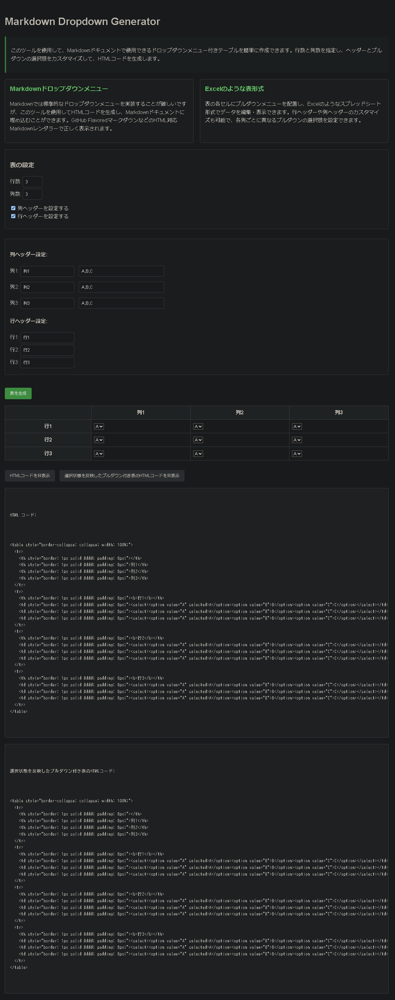

[](https://opensource.org/licenses/MIT)
[](https://www.javascript.com/)
[](http://makeapullrequest.com)
[](https://app.netlify.com/sites/2f0833e717-markdown-dropdown/deploys)

# Markdown Dropdown Generator

## プロジェクト概要
このプロジェクトは、Markdownドキュメントで使用できるドロップダウンメニュー付きテーブルを簡単に作成するためのWebツールです。Excelのような表形式でプルダウンメニューを設定し、行と列のサイズを指定し、ヘッダー設定やプルダウンの選択肢をカスタマイズして、HTMLコードを生成できます。



### Markdownドロップダウンメニュー
Markdownでは通常、標準的なドロップダウンメニューを実装することが難しいですが、このツールを使用することで、HTMLコードを生成し、Markdownドキュメントに埋め込むことができます。生成されたコードは、GitHub FlavoredマークダウンなどのHTML対応Markdownレンダラーで正しく表示されます。

### Excelのような表形式のプルダウンメニュー
表の各セルにプルダウンメニューを配置し、Excelのようなスプレッドシート形式でデータを編集・表示することができます。行ヘッダーや列ヘッダーのカスタマイズも可能で、各列ごとに異なるプルダウンの選択肢を設定できます。

## 特徴
- 行数・列数を自由に設定可能
- 列ヘッダーと行ヘッダーの表示/非表示を切り替え可能
- 各列のヘッダー名とプルダウンの選択肢をカスタマイズ可能
- 現在の選択状態を保持したHTMLコードの生成
- 生成されたHTMLコードをMarkdownドキュメントにコピー＆ペースト可能
- 列ごとに異なるプルダウン選択肢の設定が可能

## 使い方
1. `src/html/index.html`ファイルをブラウザで開きます
2. 行数と列数を指定します
3. 必要に応じて列ヘッダーと行ヘッダーの表示設定を行います
4. ヘッダー名とプルダウンの選択肢を設定します
5. 「表を生成」ボタンをクリックしてテーブルを作成します
6. プルダウンから希望の値を選択します
7. 「HTMLコードを表示」または「選択状態を反映したプルダウン付き表のHTMLコードを表示」ボタンをクリックします
8. 生成されたHTMLコードをコピーしてMarkdownドキュメントに貼り付けます


## ファイル構成
プロジェクトは以下のディレクトリ構造で整理されています：

```
markdown-dropdown/
├── src/
│   ├── html/
│   │   └── index.html    # メインHTMLファイル
│   ├── css/
│   │   └── style.css     # スタイルシート
│   └── script/
│       ├── markdown-dropdown-core.js    # コア機能と初期化処理
│       ├── markdown-dropdown-header.js  # ヘッダー設定関連の機能
│       ├── markdown-dropdown-table.js   # テーブル生成と操作の機能
│       └── markdown-dropdown-export.js  # HTMLコード表示とエクスポート機能
└── README.md
```

## インストール
特別なインストールは必要ありません。リポジトリをクローンまたはダウンロードして、`src/html/index.html`ファイルをブラウザで開くだけで使用できます。

```bash
git clone https://github.com/2f0833e717/markdown-dropdown.git
cd markdown-dropdown
# ブラウザでsrc/html/index.htmlを開く
```

## 制限事項
- 生成されたHTMLコードは、GitHub FlavoredマークダウンやHTMLをサポートするMarkdownプロセッサでのみ正しく表示されます
- 一部のMarkdownレンダラーでは、セキュリティ上の理由からJavaScriptが無効化されるため、ドロップダウン機能が動作しない場合があります

## 開発
ソースコードの修正や機能追加を行う場合は、それぞれのディレクトリにあるファイルを編集してください：
- HTMLの修正: `src/html/index.html`
- スタイルの変更: `src/css/style.css`
- 機能の追加・変更: 
  - コア機能と初期化処理: `src/script/markdown-dropdown-core.js`
  - ヘッダー設定関連の機能: `src/script/markdown-dropdown-header.js`
  - テーブル生成と操作の機能: `src/script/markdown-dropdown-table.js`
  - HTMLコード表示とエクスポート機能: `src/script/markdown-dropdown-export.js`

## 貢献方法
プロジェクトへの貢献を歓迎します。バグ報告、機能リクエスト、プルリクエストなどお気軽にご連絡ください。

## ライセンス
このプロジェクトはMITライセンスの下で提供されています。詳細については[LICENSE](LICENSE)ファイルを参照してください。
